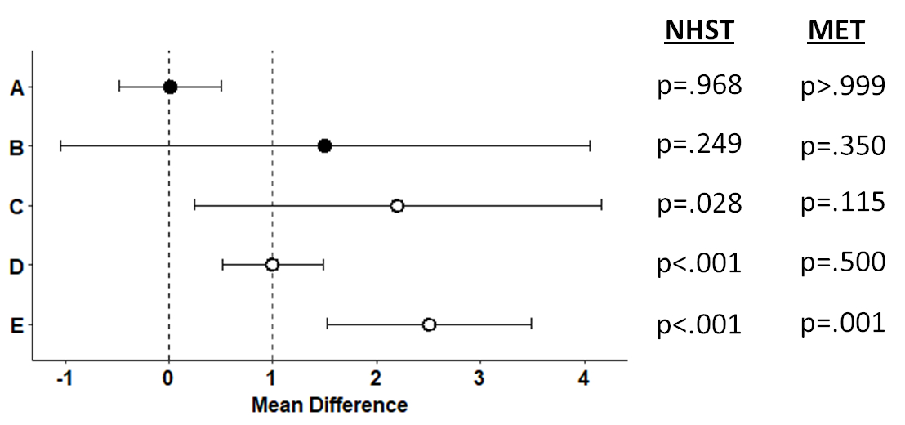
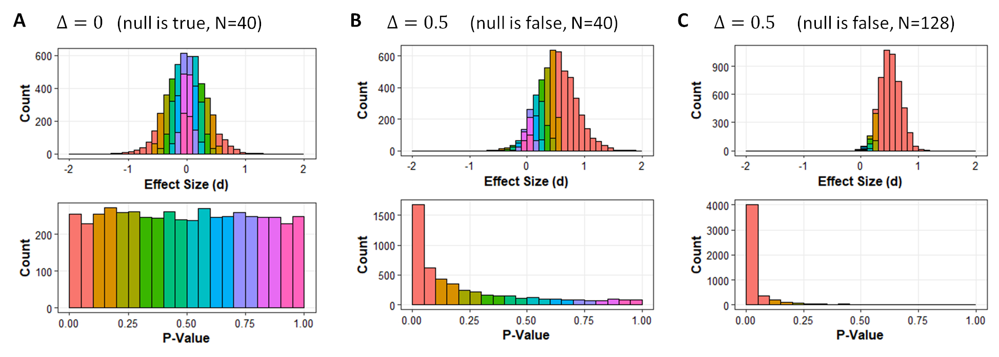

```{r setup, include=FALSE}
# To COMPILE RUN THE CODE BELOW
# rmarkdown::render(<your-rmd-file.rmd>, output_format ="all")
library(knitr)
library(tidyverse)
library(kableExtra)
## Global options
#options(max.print="75")
opts_chunk$set(echo=FALSE,
	             cache=TRUE,
               prompt=FALSE,
               tidy=TRUE,
               comment=NA,
               message=FALSE,
               warning=FALSE, fig.pos = "H") #,fig.pos = "H", out.extra = ""
#opts_knit$set(width=75)
```

# Introduction

Recently, @1 (hereafter referred to as "the Editorial") published an editorial on behalf of the International Society of Physiotherapy Journal Editors (ISPJE), recommending that researchers stop using null hypothesis significance tests and adopt "estimation methods". Further, the editorial warns that this is not merely an idea to consider, but a coming policy of journals: "the [ISPJE] will be expecting manuscripts to use estimation methods ***instead*** of null hypothesis statistical tests" (emphasis added). However, the Editorial is deeply flawed in its statistical reasoning. If the proposed policies were adopted, they could damage the statistical literacy and scientific integrity of the field.

I detail each of my critiques below, but in short the Editorial: (1) fails to adequately grapple with the inherent connection between hypothesis testing and estimation as methods of statistical inference, (2) presents several misleading arguments about the flaws of statistical significance tests, and (3) presents an alternative that is, in itself, a form of significance testing---the minimal effects test [@2] (but the alternative does this implicitly and muddles two-sided and one-sided hypothesis testing). Finally, I end with a short list of more urgent problems that the ISPJE could work to address.

I commend the Editorial for encouraging researchers to think deeply about the statistical tools available to them, to consider "practical significance" as well as "statistical significance", and for bringing important methodological discussions to the forefront of physical therapy research. However, the central argument of the Editorial is illogical and I worry what coming policy changes might mean for how authors interpret their data. I think the antidote to researchers making faulty decisions is not to ban *p*-values, but to improve education. A rising tide lifts all boats, and if the baseline statistical literacy in our field were higher, authors would make fewer mistakes, reviewers would be more apt to catch remaining mistakes, and readers would be better equipped to make their own conclusions given the available data. Editors then need to hold the line and ensure rigorous review, not ban valid statistical tools.

# Hypothesis testing and estimation are inescapably intertwined

The Editorial presents hypothesis testing and estimation as two distinct methodological approaches. However, these approaches are two sides of the same coin, as illustrated by a simple example in Figure 1. When a 95% confidence interval excludes the null value, then one can reject the null hypothesis at *p* < .05. This is because hypothesis tests and confidence intervals are based on the same underlying mathematics: e.g., how big is the observed effect relative to the variability we would expect due to sampling? Although typically we think of the null-hypothesis as an assumption of "no effect", the null hypothesis can assume zero or non-zero effects. So, as shown in Figure 1, we can ascertain the probability of observing the data we did, assuming a null value of 0 or a null value of 1.

```{r fig1pdf, fig.cap = "Figure 1: 95\\% confidence intervals and corresponding \\emph{p}-values for testing $H_{0}: \\Delta = 0$ (NHST, null hypothesis significance testing) and $H_{0}: \\Delta \\leq 0$ (MET, a one-sided minimal effects test). Open circles indicate mean differences with \\emph{p} < 0.05 for the NHST.", fig.align = "center", out.width = "80%"}
if(!knitr::is_html_output()){
  knitr::include_graphics("figs/fig1.pdf")
}
# Include for PDF

```


```{r fig1html, fig.cap = "Figure 1: 95\\% confidence intervals and corresponding \\emph{p}-values for testing $H_{0}: \\Delta = 0$ (NHST, null hypothesis significance testing) and $H_{0}: \\Delta \\leq 0$ (MET, a one-sided minimal effects test). Open circles indicate mean differences with \\emph{p} < 0.05 for the NHST.", out.width = "80%"}
# Include for html
if(knitr::is_html_output()){
  
}
```

Hypothesis testing and estimation cannot be fully disentangled: estimation (frequentist or Bayesian) asks about *plausible values* of the parameter in the population, hypothesis testing asks about the *plausibility of a specific parameter value*. These are both inferences, because we are inferring something about the population based on the data in our sample. In the frequentist paradigm, uncertainty in the inference is accounted for with long-run error control; e.g., setting the Type 1 Error rate, $\alpha$ = 0.05. We can see this when running simulations as shown in Figure 1A-E: any confidence interval that does not contain zero also has *p* < 0.05 for the null hypothesis significance test (NHST).

The 95% confidence interval shows values in the population that are *compatible* with what we observed in the sample [@3]. That is, if you move outside of the confidence interval, any of those parameter values (the "true" mean differences; $\Delta$’s) would be statistically different from the mean difference observed in the sample $(\bar{X}_{d})$ at the *p* < 0.05 level. Inside of the confidence interval, none of those parameter values would be statistically different (p > 0.05) from the observed mean difference. Recall that the *p*-value is the probability of observing data as extreme or more extreme, assuming that the null hypothesis is true, formally written as $p(\geq\bar{X}_d|H_{0})$.

Typically, the null hypothesis significance test (NHST) assumes that the true value in the population is 0 (i.e., $H_{0}:\Delta = 0$). The further the sample mean difference is away from 0, the lower the probability of observing that sample mean, if the null hypothesis were true. Importantly, the Editorial does not address the fact that we can set $H_{0}$ to be any value. For instance, rather than setting $H_{0}:\Delta = 0$ (sometimes referred to as the "nil-hypothesis") [@4], we can set $H_{0}$ equal to any clinically meaningful value of interest. This is referred to as a minimal effects test (or minimum effect test, MET) [@2;@5]. For the sake of argument, let’s say this value is 1 in Figure 1. Comparing the confidence intervals to the new null value, you can see that any confidence intervals that only contain values larger than 1 also have a *p* < 0.05 for the minimal effects test (i.e., Figure 1E).[^1] Thus, we have both an inference about a specific hypothesis and an estimate in both the NHST and the MET[^2], but the hypothesis test and the estimate are complementary and connected.

[^1]: METs are typically directional, using one-sided hypothesis tests (e.g., $H_{0}: \leq 1$) whereas NHSTs are often non-
directional, using two-sided hypothesis tests (e.g., $H_{0}: \,= 0$). Thus, although the confidence interval for Figure 1A
does not contain the null value of 1, the whole of the confidence interval is below 1, thus yielding a non-significant
minimal effects test.

[^2]: For convenience, I am referring to NHST and MET as separate tests. However, it is more accurate to think of the
MET as a type of NHST where you have a one-sided test of a non-zero null value. I use the different terms because
readers are likely more familiar with the term NHST when referring to the specific case of $H_{0} = 0$ [@4].

# Misleading arguments about flaws with significance tests

The Editorial bases many arguments on a previous list of perceived problems from @6. The @6 paper is in itself an editorial that presents informed arguments, but is not an objective demonstration of any mathematical facts. So, reinforcing the Editorial's list through a citation to @6 does not provide an evidentiary foundation: it is layering opinion on top of opinion. Second, each of the five "problems" outlined by the Editorial is either not really a problem inherent to *p*-values or the problem is a true but misleading statement. I address each problem from the Editorial (in quotes) below:

**1. "A *p*-value is not the probability that a hypothesis is (or is not) true."** -- This is correct, but it does not follow that this makes *p*-values, or even statistical significance tests, unhelpful or uninformative. Knowing that the observed data are incompatible with some null value is a crucial step for many research questions. For instance, hypothesis testing in early phase research can help us make decisions about where to direct our resources, starting us down the road of replication and ultimately determining the efficacy and effectiveness of an intervention.

**2. A *p*-value does not constitute evidence** -- This is an oversimplification and misleading. The Editorial is correct that a single *p*-value is not strictly speaking "evidence" and cannot tell us about the probability of the null hypothesis being true. However, *p*-values are still useful tools for making decisions.

Technical definitions of evidence can get a bit complicated and are debated [@7;@8;@9]. However, I would invite readers to consider a simple example of absolute probability versus relative probability. If I find that eating green jelly beans reduces post-surgical recovery time for the ACL by 10% relative to controls with *p* < 0.05, then the most likely explanation is still that jelly beans have no effect on recovery and what I observed was chance fluctuation. That is, the null hypothesis is still the most likely explanation even though p was < 0.05, because the baseline probability of "jelly bean efficacy" is very low and false positives occur 5% of the time when $\alpha$ = 0.05 . Thus, the *p*-value is not in itself a measure of evidence, because I would need additional *outside information* in order to change (or not change) my beliefs. As @9 write "The *p*-value is not adequate for inference because ***the measurement of evidence*** requires are least three components: the observations, and two competing explanations for how they were produced" (p. 1569; emphasis added).

Some researchers might think of the *p*-value as evidence against the null specifically, without the need for comparison to a given alternative. But the *p*-value is calculated assuming that the null is true, so again the Editorial is correct that we cannot simply flip the question around, assume the data, and get the likelihood of the null being true, i.e., $p(\bar{x}_{d}|H_{0}) \neq p(H_{0}|\bar{x}_{d})$. To estimate the likelihood of the null hypothesis being true, we would need Bayesian statistics in which we formalize some prior probability about the null hypothesis [@9]. If we have a strong enough prior probability that the null is true, then the current data in the sample may not lead us to change our beliefs based on the posterior distribution, no matter how small the *p*-value. This was the case in my jelly bean example, where *p* < 0.05 still did not shake my belief in the null hypothesis. For any given prior distribution, however, there is a smaller likelihood of observing highly discrepant effects (e.g., $|\bar{x}_{d}| >> 0$), leading to a smaller relative probability of 0 in the posterior distribution compared to the prior distribution.[^3] Updating the probability of 0 in the posterior distribution reflects rational decision making in daily life. For instance, the first time I find jelly beans reduce recovery time with *p* < 0.05, I might rightly ignore that as a false positive. The fifth time I find jelly beans reduce recovery time with *p* < 0.05, I should take a long hard look at the ingredients and maybe my study procedures; as *p* < 0.05 is not always a sign that the null is wrong, but that some other assumption has been violated.

[^3]: For a humorous demonstration see: https://xkcd.com/1132/; for a more quantitative visualization of the relationship between priors, *p*-values, and posteriors see: https://rpsychologist.com/d3/bayes/. More technically, the posterior (the updated probability density function after we have seen the data) is proportional to the prior (our expectation before we saw the data) multiplied by the likelihood (which is the probability of the current data given the hypothesis): $posterior \propto likelihood \times prior$.

Still, the *p*-value does not need to be a measure of evidence for it to be useful. Critically, small *p*-values are relatively less likely to be observed when the null hypothesis is true compared to when an alternative hypothesis is true. Thus, in a practical sense, a *p*-values can help us make decisions about what effects to study, assuming that we are testing at least some real effects. As shown in Figure 2A, *p*-values have a uniform distribution under the null hypothesis, with 5% of *p*-values necessarily below 0.05. However, if the null is not true, then we will see a shift in the distribution of *p*-values, with small *p*-values becoming more common. An example of this is shown in Figure 2B, where the null is false and 34% of *p*-values are below 0.05. However, correctly rejecting the null hypothesis only 34% of the time is not ideal, so consider Figure 2C, where I have now tripled the sample size and 80% of *p*-values are below 0.05. That is, with 64 people per group, we now have 80% statistical power to detect a $\Delta = 0.5$.

```{r fig2pdf, fig.cap = "Figure 2: \\emph{P}-values < 0.05 are more likely to occur when the null is false, and critically will only occur 5\\% of the time when the null is true. Plots show simulated experiments ($k$ = 5,000, $\\sigma$ = 1 for all populations) in which the means of two independent groups are compared using a t-test. In Panel A, the null hypothesis is true and the true difference between population means is 0. In Panel B, the null hypothesis is false and the true difference between population means is 0.5. In Panel C, the null-hypothesis is still false, but I have increased the sample size from 40 to 128, yielding 80\\% of \\emph{p}-values < 0.05 (i.e., 80\\% statistical power). Quantiles are color coded with respect to their \\emph{p}-values and effects sizes are given as Cohen’s $d$.", fig.align = "center", out.width = "100%"}
if(!knitr::is_html_output()){
  knitr::include_graphics("figs/fig2.pdf")
}
# Include for PDF

```


```{r fig2html, fig.cap = "Figure 2: \\emph{P}-values < 0.05 are more likely to occur when the null is false, and critically will only occur 5\\% of the time when the null is true. Plots show simulated experiments ($k$ = 5,000, $\\sigma$ = 1 for all populations) in which the means of two independent groups are compared using a t-test. In Panel A, the null hypothesis is true and the true difference between population means is 0. In Panel B, the null hypothesis is false and the true difference between population means is 0.5. In Panel C, the null-hypothesis is still false, but I have increased the sample size from 40 to 128, yielding 80\\% of \\emph{p}-values < 0.05 (i.e., 80\\% statistical power). Quantiles are color coded with respect to their \\emph{p}-values and effects sizes are given as Cohen’s $d$.", out.width = "100%"}
# Include for html
if(knitr::is_html_output()){
  
}
```

This is where the concept of a decision is important to distinguish from the term "evidence" [@9]. Without knowing the actual evidence against the null-hypothesis, if I decide to reject the null when *p* < 0.05, then I will only be wrong 5% of the time (i.e., the Type 1 error rate). Similarly, if I have 80% statistical power and a reasonable estimate for the smallest effect size of interest, then I only have a 20% chance of missing an effect of that size (i.e., the Type 2 error rate). Mathematically, these probabilities are robust if we accept the null-hypothesis as true and make minimal other assumptions, which is very helpful when limited outside information is available. See Goodman quoting Neyman and Pearson about hypothesis testing, "Without hoping to know whether each separate hypothesis is true or false, we may search for rules to govern our behaviour with regard to them, in following which we insure that, in the long run of experience, we shall not often be wrong" [@10].

So, *p*-values are not a measure of evidence, but they are useful tools for helping us make the correct decision. If we want a proper measure of evidence for one hypothesis versus another, then we can do more work, but we also need to make more assumptions and/or bring in outside information. This can be both a feature and bug of *using* hypothesis tests. We can control long run error rates with minimal information, but if we do that so habitually that we forget other information is available, then that is on us not the *p*-value.

**3. "Statistically significant findings are not very replicable."** -- This is misleading. First, it is difficult to precisely define replication [@11;@12], but if we think about "being replicable" as the probability that a statistically significant result represents a real, non-zero effect then we would expect more statistically significant findings to "replicate" provided that hypothesis tests have adequate statistical power, researchers have not engaged in *p*-hacking, there is not selective reporting of results, etc. Thus, not all statistically significant findings will replicate [@13], but statistically significant findings in well-designed studies are more likely to replicate [@14;@15;@16]. Second and by any definition, threats to replicability are also going to affect confidence intervals (the Editorial’s proposed solution) as much as they affect *p*-values, because, again, the *p*-value is intrinsically linked to the confidence interval. Thus, the Editorial is correct in a practical sense: many statistically significant findings in the current literature do not replicate. However, a lack of replication is the fault of poor study design and questionable research practices, not the use of hypothesis tests as a method of inference.

**4. "In most clinical trials, the null hypothesis must be false."** -- This is arguably true but very misleading. It is true that real treatment effects are unlikely to be precisely 0 (e.g., they might be +0.001), but it raises the question: Do we really care if the true effect is 0 or 0.001? And will we ever have the statistical precision to discern that difference? All measurement has some error, so I would argue that many effects are functionally 0 even if the (unknowable) true value is not actually zero. But, in a strict mathematical sense I will concede the Editorial is correct, if we accept a hyper-precise definition, the null-hypothesis of $H_{0}: \Delta = 0.\overline{00}$ will usually be false. However, if we accept that definition, then all point-estimates are false and no value will ever be precisely the minimum clinically important difference either, which is the Editorial’s proposed point-estimate in their alternative.

In response [@17] to an independent critique by @18, this hyper-precise definition does seem to be the argument that the editorial is making.[^4] They claim, "The assertion that the null hypothesis is false in most clinical trials does not require empirical evidence, because it is self-evidently true" and "The null hypothesis may often be approximately true, but it is rarely if ever exactly true". The Editorial seems to miss the point that the null is a useful model: testing against 0 is still useful for things that are approximately 0. As an analogy, I have successfully found my way many places using maps, but none of those maps was a photo-realistic version of reality.

[^4]: I was very excited to see the @18 commentary and others [@19], and even more excited to see we all largely agree. Interestingly, however, I only became aware of these commentaries after writing my own because I did not see the editorial until it was re-published in Physical Therapy [@1] in June, 2022, whereas my more astute colleagues responded to the original publication in the Journal of Physiotherapy [@20], in January 2022. The editorial has been re-published in four different journals to date. While I can appreciate trying to spread one’s message, this creates confusion.

Scientists are often working on the frontiers of human knowledge; this is costly work where we need to explore a lot of different ideas and many them do not pan out. That is, many tested "effects" are functionally zero [@14]. So, simply because a point estimate of precisely 0 is unlikely to be true does not mean that it is unhelpful to ask. It should be a very low bar to show that your clinical treatment has a non-zero effect! Further, the Editorial is specifically critiquing this "nil" hypothesis (i.e., $H_{0} = 0$), when we could hypothesize any value, or avoid the point-null entirely with a one-sided test (i.e., $H_{0} \leq 0$) [@2;@5]. So, if assuming $H_{0} = 0$ is not desirable, we can set that null value to be anything we want (i.e., $H_{0}: \Delta \leq 0.4$ m/s for improvement in gait speed, $H_{0}: \Delta \leq 30$% change on a pain scale, or $H_{0}: \Delta \leq 1$ in the hypothetical example in Figure 1).

**5. "Researchers need information about the size of effects."** -- This is a true statement, but it is not a problem with *p*-values nor null hypothesis significance tests. To my knowledge, no statistician has ever recommended that applied researchers ignore measures of effect size (either raw or standardized). Estimates of effect size are integral to any results section. I would even take this one step further and encourage authors to share their data whenever possible [@21], enabling other researchers to calculate their own effect sizes as there can be limitations with and confusion about standardized effects sizes, and there is no one-size-fits-all solution to effect sizes [@22;@23;@24].

# The Editorial’s "alternative" is a hypothesis test – the Minimal Effects Test

After detailing the potential problems with the NHST, the Editorial proposes an alternative solution in which they encourage authors to compare their 95% confidence interval to some minimum clinically meaningful value (which I will write as $\delta$).[^5] Estimation is a good practice and I would encourage researchers to report 95% confidence intervals and interpret their upper and lower limits in context, when appropriate. However, what the Editorial is suggesting is effectively an MET where $H_{0}: \Delta \leq \delta$. That is, if the test is to see if the 95% confidence interval does not contain $\delta$, then that is mathematically equivalent to an MET assuming $H_{0}: \Delta \leq \delta$ and finding *p* < 0.025. Note *p* < 0.025, not *p* < 0.05, because most METs are one-sided hypothesis tests whereas confidence intervals are two sided (see Figure 1 and Footnote 1). After heavily critiquing hypothesis testing as a method of inference, the Editorial ends up effectively proposing a hypothesis test. This is clearly an illogical proposition.

[^5]: I caution that it is difficult to find a single measure of $\delta$; it changes as a function of the study population, the study context, and has its own uncertainty due to sampling error [@19;@25].

I want to emphasize that it is valid for the Editorial to recommend that authors consider their 95% confidence interval relative to some clinically meaningful value. However, this is not an "alternative" to conducting a null hypothesis significance test, it is in fact mathematically identical to conducting a null hypothesis test with a carefully chosen null hypothesis. Both are valid.

I would add, however, that there are also advantages to explicitly framing this as a hypothesis test rather than the informal interpretation of a confidence interval. First, it encourages researchers to explicitly commit to a specific $\delta$ while the study is being designed, rather than simply obtaining an estimate of the effect and then comparing it to candidate $\delta$’s post hoc. Second, it requires researchers to think carefully about the direction of the test and the desired $\alpha$-level, whereas simply invoking a 95% confidence interval implicitly uses a two-tailed test and $\alpha = 0.05$, which may not be best suited to the research question.

Finally, it is also important to stress that history provides us with several examples of how authors will view their data through rose-tinted glasses when quantitative statistical safeguards are removed. For instance, when *Basic and Applied Social Psychology* banned *p*-values, authors were found to overstate their conclusions well beyond what would have been considered if "statistical significance" had been a benchmark [@26]. In sport and exercise science, "magnitude-based inference" was leveraged as a niche method that allowed authors to interpret differences as meaningful when they had very little statistical support (e.g., *p*’s > 0.25) [@27;@28;@29]. Statistical significance in an NHST does not necessarily need to be the benchmark nor 0.05 the default value [@30;@31;@32;@33], but it is always important to have a statistically sound framework for dealing with uncertainty.

# Virtues of hypothesis testing

One of the great virtues of null hypothesis significance testing is Type I error control while making minimal assumptions about the nature of the data or the world at large. If we set $\alpha = 0.05$, then we can be confident we will only get data greater than or equal to what we observed 5% of the time when the null is true. Importantly, this works for a wide range of statistics and types of tests, including *F*- and $\chi^2$-statistics that have multiple degrees of freedom from models asking questions about multiple effects simultaneously. For instance, in a randomized controlled trial with three arms, I could conduct an omnibus *F*-test and obtain a *p*-value to see if there is any evidence of a difference between groups overall, before conducting additional post-hoc tests to compare specific groups. This situation is not covered by the Editorial and the Editorial’s confidence interval alternative is not easily applied here, although one could plausibly adjust the width of the confidence intervals to control for multiple comparisons.

# Bigger threats to statistical integrity

Misinterpretation and misuse of *p*-values are threats to statistical integrity. However, questionable research practices such as *p*-hacking, sub-group analyses, flexible stopping rules, selective exclusion of outliers, selective reporting, and hypothesizing after results are known (HARKing) are much larger threats [@34;@35;@36;@37;@38]. Furthermore, these questionable research practices have consistently negative consequences regardless of the method of inference. For instance, although the term "*p*-hacking" connotes the NHST, these questionable research practices pose an equal threat to confidence intervals because again confidence intervals and *p*-values are based on the same underlying mathematics. Similarly, switching to a fully Bayesian method of analysis is not an antidote for poor study design, small samples, and questionable research practices. As others have argued [@39;@40], *p*-values get a disproportionate amount of attention in popular discussions of research methodology. I encourage the ISPJE to instead focus their attention on methods for improving data/code sharing, transparency, and replicability through tools like preregistration, results-blind review, registered reports, or even "data papers" whose primary function is to report a study and archive the data, without drawing inferences from limited samples.

It is entirely valid to say that *p*-values are often mis-used and mis-interpreted, and "statistical significance" may not ultimately be the best term for applied researchers to use [@41]. However, it is incorrect to present these human errors as inherent flaws in hypothesis testing. For instance, if someone mis-interprets p > 0.05 as evidence of "no difference", then I would argue the correct action is to teach them about equivalence tests and non-inferiority designs, not ban *p*-values. Similarly, there are times when Bayesian inference is what authors are really interested in (e.g., what is the probability that the null is true, given the evidence?), and in those cases Bayesian inference can and should be used. However, Bayesian analysis is not a panacea and needs to be used thoughtfully like any statistical tool. So, although a simple heuristic of *p* < 0.05 may well be overused as "the" test in physical therapy research, frequentist hypothesis tests are still valid and useful tools for physical therapy researchers. Moreover, the scientific integrity of the field has much larger concerns, and both *p*-values and confidence intervals will be corrupted by *p*-hacking, under-powered subgroup analyses, surrogate outcomes, and other questionable research practices.

In conclusion, I agree with the Editorial on the importance of reporting effect sizes and interpreting them in context. However, the Editorial makes numerous statistical *faux pas* that could harm the statistical literacy in our field, if readers take them at face value, and harm the scientific integrity of our field, if put into editorial practice.

\newpage

# Additional Information

## Data Accessibility

`R` code for all analyses and simulations presented in this commentary are included as a digital supplement on SportRxiv (https://sportrxiv.org/index.php/server/preprint/view/178/version/211).

## Conflict of Interest

Author has no conflicts of interest to declare.
  
## Funding

None.

## Acknowledgments

I would like to thank Dr. Emma Johnson, Dr. Kristin Sainani, and two anonymous reviewers for their detailed comments on earlier drafts of this commentary.

## Preprint

The pre-publication version of this manuscript can be found on SportRxiv (DOI: 	https://doi.org/10.51224/SRXIV.178).

\newpage

# References
<!-- get citations json format using www.anystyle.io -->

\parindent0pt 
\setlength{\parskip}{1em}

